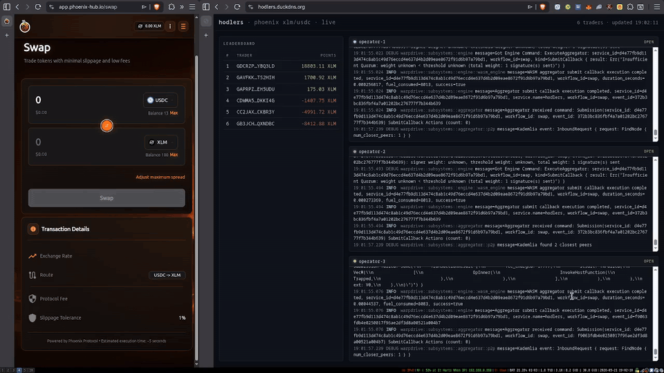

# hodlers-app

<p align="center">
  
</p>

A verifiable, on-chain points ledger for Phoenix XLM-USDC traders, computed by
a quorum of off-chain WarpDrive operators and settled to Stellar.

Every time a trader swaps with the [Phoenix](https://app.phoenix-hub.io)
XLM-USDC pool on Stellar mainnet, an independent operator set watches the pool's
contract events, agrees on a `(trader, delta)` payload (buy XLM → +amount,
sell XLM → −amount), signs the result with ed25519 / SEP-53, and a single
signed transaction credits the trader's points on a Soroban contract on
testnet. Anyone can read the ledger or independently verify the signatures.

This is a tech-demo submission showcasing that
[WarpDrive](https://github.com/warp-driver/warpdrive) can drive a real,
Stellar-native, BFT-quorum-attested workflow end-to-end on testnet - from
mainnet event ingestion to on-chain settlement - without any centralised
operator or off-chain indexer.

## What this demo proves

- **WarpDrive subscribes to Stellar mainnet (pubnet) contract events.** The
  circuit watches a real Phoenix XLM-USDC pool and reacts to every swap.
- **A WASI 0.2 circuit produces quorum-attested output that a Soroban contract
  can verify on-chain.** The handler uses the standard
  `Ed25519VerificationInterface` from [`warpdrive-shared`](https://github.com/warp-driver/warpdrive-contracts/tree/main/packages/shared) - no bespoke crypto
  in the demo path.
- **The whole flow is open and uncoordinated.** Every operator independently
  watches mainnet, aggregates signatures over libp2p, and any of them may
  submit; the on-chain handler dedupes by `event_id`.
- **End-to-end latency is seconds.** Mainnet swap → 2-of-3 quorum → testnet
  `add_points` typically completes within one Stellar ledger close.

## Architecture

```
Phoenix XLM-USDC pool  (Stellar mainnet)
   │  8 contract events per swap (sender, sell_token, buy_token,
   │  offer_amount, return_amount, …)
   ▼
WarpDrive trigger pipeline  (one Guest::run per event, per operator)
   │
   ▼
┌──────────────────────────────────────────────────────────────┐
│ components/circuit  - WASI 0.2                               │
│   • decodes one event field per invocation (phoenix.rs)       │
│   • accumulates SwapState in wasi:keyvalue with CAS retry    │
│     (state.rs) → exactly-once delivery despite 8 concurrent  │
│     events per swap                                          │
│   • emits XDR-encoded HodlersPayload {trader, delta}         │
│     (payload.rs) once SwapState is complete                  │
└──────────────────────────────────────────────────────────────┘
   │
   ▼
WarpDrive aggregator  (per-operator; ed25519 / SEP-53 quorum over libp2p)
   │
   ▼
┌──────────────────────────────────────────────────────────────┐
│ components/aggregator - WASI 0.2                             │
│   • emits a single Stellar SubmitAction pointing at the      │
│     stellar-handler contract                                  │
└──────────────────────────────────────────────────────────────┘
   │  one operator wins the submission race; the rest see
   │  EventAlreadySeen and back off
   ▼
┌──────────────────────────────────────────────────────────────┐
│ contracts/stellar-handler  (Soroban, testnet)                │
│   verify_xlm(envelope_bytes, sig_data):                      │
│     • XDR-decodes XlmEnvelope                                │
│     • delegates ed25519 quorum check to                      │
│       contracts/ed25519-verification                          │
│     • XDR-decodes inner HodlersPayload                       │
│     • forwards (trader, delta) to contracts/hodlers          │
│     • marks event_id seen + emits Verified                   │
└──────────────────────────────────────────────────────────────┘
   │
   ▼
┌──────────────────────────────────────────────────────────────┐
│ contracts/hodlers  (Soroban, testnet)                        │
│   add_points(trader, delta) - open call; trust guarantee is  │
│     upstream (only the handler can produce envelopes that    │
│     verify against the quorum)                                │
│   points_of(trader), all_points() - public queries           │
└──────────────────────────────────────────────────────────────┘
```

## Components

### Soroban contracts (`contracts/`)

| Path | Role | Key surface |
|---|---|---|
| `hodlers/` | Points ledger | `add_points(trader, delta) -> Result<i128>`, `points_of(trader) -> i128`, `all_points() -> Vec<TraderPoints>` |
| `stellar-handler/` | WarpDrive handler entry point | `verify_xlm(envelope_bytes: Bytes, sig_data: Ed25519SignatureData) -> Result<(), HandlerError>` |
| `ed25519-security/` | Operator pubkey + weight registry, consensus threshold | `add_signer`, `set_threshold`, `get_signer_weight_at(...)`, ... (vendored verbatim from [warp-driver/warpdrive-contracts](https://github.com/warp-driver/warpdrive-contracts)) |
| `ed25519-verification/` | Stellar-native quorum signature checker | `try_verify(envelope, signatures, signers, reference_block)` (vendored from the same warpdrive-contracts repo) |

All four contracts compile with `soroban-sdk = 26` and
[`warpdrive-shared`](https://github.com/warp-driver/warpdrive-contracts/tree/main/packages/shared) `= 0.2.4`. They are standalone Cargo packages (no
`[workspace]` parent) so `[profile.release].overflow-checks = true` actually
applies - overflow-checks at the workspace root would NOT propagate to a
contract crate.

### WASI 0.2 components (`components/`)

| Path | Role |
|---|---|
| `circuit/` | Event accumulator + payload emitter. Subscribes to `("swap", *)` on the Phoenix pool; uses `wasi:keyvalue/atomics` CAS (`state.rs`) to merge the 8 concurrently-fired events of one swap into a single `SwapState` keyed by `tx_hash:op_index`; emits XDR `HodlersPayload` once `{sender, sell_token, buy_token, offer_amount or return_amount}` is filled. `finalized: bool` tombstone gives exactly-once semantics. |
| `aggregator/` | Trivial submitter - reads `chain` + `service_handler` from its service.json config and emits one `Stellar SubmitAction` per aggregation. Decoupled from any warpdrive workspace crates so the repo builds standalone. |

Both components are built via `cargo-component` to `wasm32-wasip1` (~150 KB
total combined release size).

## Why these choices

- **ed25519 / SEP-53 instead of secp256k1 / EIP-191.** Stellar-native. Lets us
  reuse the standard `Ed25519VerificationInterface` from [`warpdrive-shared`](https://github.com/warp-driver/warpdrive-contracts/tree/main/packages/shared)
  and the Stellar-handler envelope shape (`XlmEnvelope` carrying `event_id`,
  `ordering`, `payload` as raw XDR), so the demo demonstrates the canonical
  WarpDrive-on-Stellar path.
- **No admin gate on `hodlers`.** `add_points` is an open call. Trust comes
  entirely from upstream: only the handler can produce envelopes that the
  on-chain verification contract accepts, and only the quorum can produce
  envelopes the handler accepts.
- **CAS accumulator.** WarpDrive dispatches the 8 events of one Phoenix swap
  in parallel; without compare-and-swap on the kv-store, later writers
  clobber earlier ones and the accumulator never finalises. The circuit
  uses `wasi:keyvalue/atomics` for last-write-wins-only-when-snapshot-matches
  semantics, retrying on conflict.
- **Each contract is its own Cargo package.** `[profile.release]` settings
  only take effect at the workspace root in Cargo, so `overflow-checks =
  true` for mainnet-style contract safety required each contract to be its
  own root.
- **Single source of truth for the inner payload.** `HodlersPayload` is a
  Soroban `contracttype` (`{delta: i128, trader: String}`) decoded by
  `Hodlers::add_points`-caller in the handler. The circuit constructs the
  matching XDR `ScMap` by hand using `stellar-xdr` (no Soroban SDK in the
  WASI component); the binding to the contract type is one shared shape, not
  duplicated logic.

## Repo layout

```
hodlers-app/
├── components/
│   ├── circuit/                       # WASI 0.2 component (cargo-component)
│   └── aggregator/                    # WASI 0.2 component
├── contracts/
│   ├── hodlers/                       # points ledger
│   ├── stellar-handler/               # WarpDrive handler entry point
│   ├── ed25519-security/              # vendored from warpdrive-contracts
│   └── ed25519-verification/          # vendored from warpdrive-contracts
├── wit-definitions/
│   └── wit/
│       ├── world.wit                  # both circuit-world + aggregator-world
│       └── deps/                      # fetched by `task fetch-wit` (gitignored)
├── service/                           # service.json (gitignored, built per deploy)
├── out/                               # per-deploy artefacts (gitignored)
├── Taskfile.yml                       # build / deploy / runtime task surface
├── warpdrive.toml                     # node config (chains, p2p, gateway)
├── rust-toolchain.toml                # 1.95 + wasm32-wasip1 + wasm32v1-none
├── DEPLOY.md                          # deploy guide (single-op + multi-op)
└── LICENSE                            # GPL-3.0
```

## Quick start

```bash
# One-time
task fetch-wit
task test-contracts        # all four contracts test green
task test-circuit          # accumulator + decoder unit tests

# Single-op deploy (testnet)
export DEPLOYER_SECRET=...
export DEPLOYER_ADDRESS=...
export WARPDRIVE_SIGNING_MNEMONIC="..."
task deploy                # build + on-chain deploys
task run-node              # second terminal, leave running
task wire-service          # uploads components, registers service
task register-signer       # register operator pubkey at threshold 1/1

# Verify after a Phoenix swap on mainnet
HODLERS=$(jq -r .hodlers out/hodlers.json)
stellar contract invoke --id "$HODLERS" \
  --rpc-url https://soroban-testnet.stellar.org \
  --network-passphrase "Test SDF Network ; September 2015" \
  --source $DEPLOYER_SECRET \
  -- all_points
```

Full step-by-step (with prerequisites, multi-op setup, troubleshooting) is in
[`DEPLOY.md`](./DEPLOY.md).

## Status

**What works today**
- End-to-end testnet pipeline: mainnet Phoenix swap → quorum-signed envelope
  → `verify_xlm` on handler → `add_points` on hodlers.
- Single-operator and 2-of-3 multi-operator deployments.
- All four contracts + both components build with stable Rust 1.95.
- Soroban contract unit tests for the handler exercise the full
  XlmEnvelope/HodlersPayload XDR round-trip plus signature verification with
  the real `ed25519-verification` and `ed25519-security` contracts.

**Known limitations**
- `SwapState` per `tx_hash:op_index` is never garbage-collected after
  finalisation (a `finalized: true` tombstone stays in the kv-store). Fine
  at Phoenix's swap rate; a long-running production deployment would want a
  janitor task.
- `dev_endpoints_enabled` is on in the demo's `warpdrive.toml` for ease of
  debugging - production deployments should turn it off and add bearer auth
  before exposing the node's `:8000` HTTP surface publicly.

## License

GPL-3.0 - see [`LICENSE`](./LICENSE).
